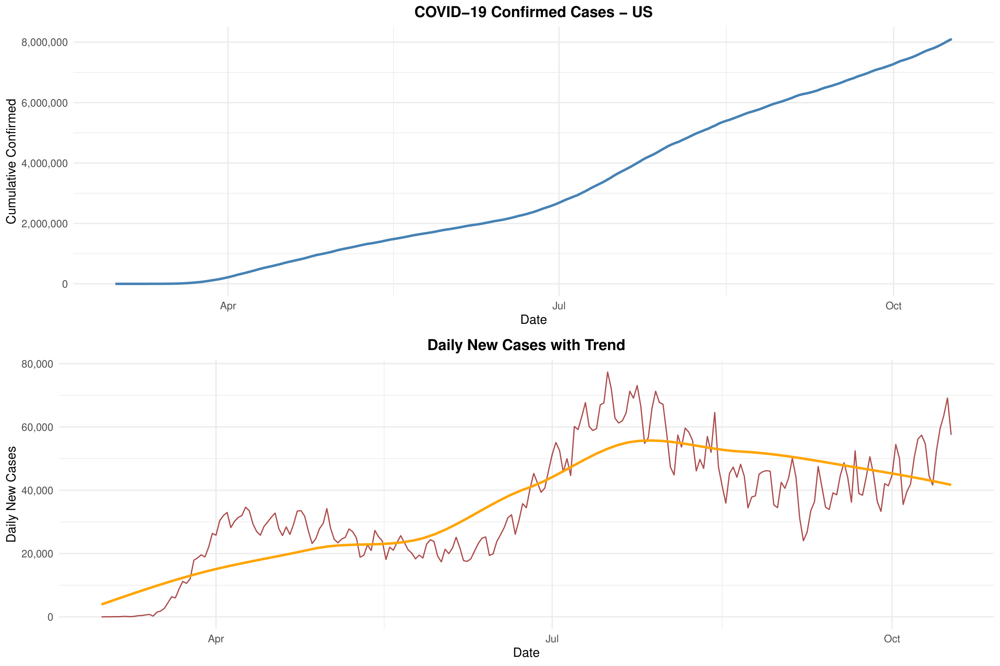
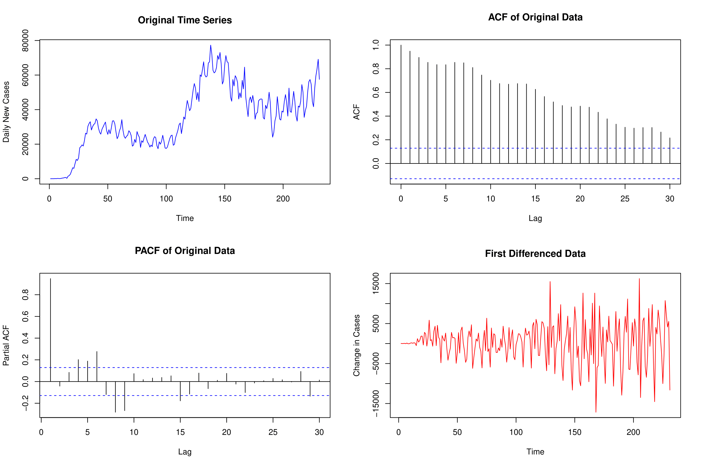
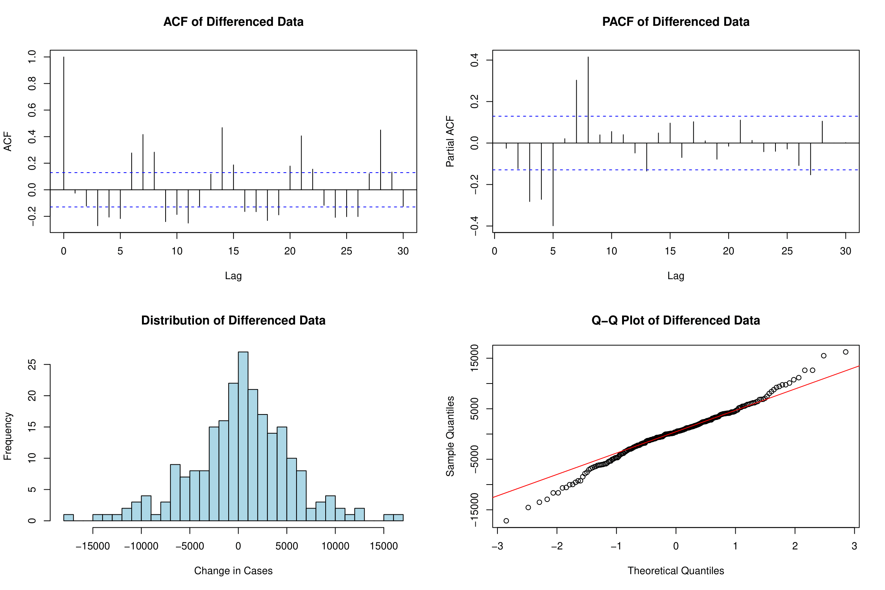
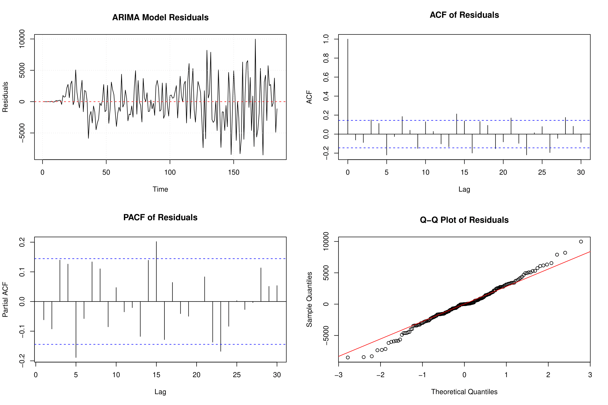
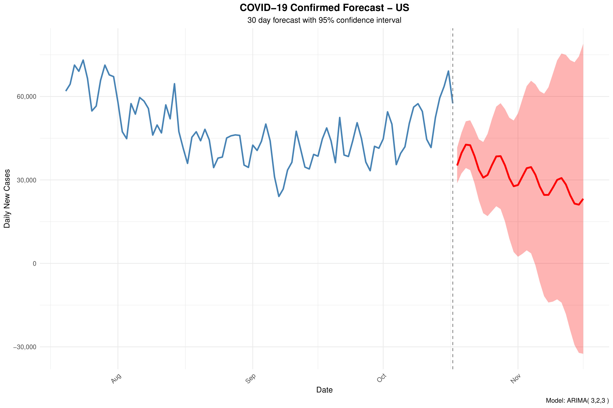

# 🦠 COVID-19 ARIMA Time Series Forecasting

[](https://www.r-project.org/)
[](https://opensource.org/licenses/MIT)
[](https://github.com/yourusername/covid19-arima-forecast)
[](https://github.com/yourusername/covid19-arima-forecast)

---

## 📊 Overview

This project implements a **comprehensive COVID-19 time series forecasting system** using **ARIMA (AutoRegressive Integrated Moving Average)** models. The tool provides automated analysis, model selection, diagnostic validation, and future predictions for COVID-19 confirmed cases, deaths, or recoveries across different countries.

The system addresses the critical need for **data-driven pandemic forecasting** by leveraging statistical time series methods to predict future case trajectories. This enables public health officials, researchers, and policymakers to make informed decisions based on quantitative projections with statistical confidence intervals.

**Key Problem Solved:** Traditional manual time series analysis is time-consuming and requires expert statistical knowledge. This automated pipeline democratizes ARIMA forecasting, making it accessible to analysts with varying levels of statistical expertise while maintaining rigorous methodological standards.

---

## ✨ Key Features

- **Automated ARIMA Model Selection**: Uses `auto.arima()` with AIC/BIC optimization to identify the best-fitting model (p, d, q parameters)
- **Comprehensive Stationarity Testing**: Performs Augmented Dickey-Fuller (ADF) tests and applies appropriate differencing transformations
- **Multi-Country Support**: Analyze data for any country in the dataset (US, China, Italy, Spain, France, Germany, etc.)
- **Flexible Metric Selection**: Forecast confirmed cases, deaths, or recovered cases
- **Rigorous Model Diagnostics**: 
  - Ljung-Box test for residual autocorrelation
  - ACF/PACF plots for model adequacy
  - Q-Q plots for normality assessment
  - Residual distribution analysis
- **Professional Visualizations**: Generates publication-quality plots using ggplot2 with customizable themes
- **Configurable Forecast Horizon**: Generate predictions for any time period (default: 30 days)
- **Train/Test Split Validation**: Evaluates model performance with MAE and RMSE metrics
- **Multiple Output Formats**: Exports results as PDF plots, CSV tables, and RData objects
- **Robust Package Management**: Automatic installation with fallback modes and multiple CRAN mirror support

---

## 🛠️ Technologies Used

### **Languages**
- **R** (version 4.0 or higher)

### **Core Libraries**
| Library | Purpose | Version Requirement |
|---------|---------|---------------------|
| `forecast` | ARIMA modeling and forecasting | Latest |
| `tseries` | Stationarity testing (ADF test) | Latest |
| `ggplot2` | Advanced data visualization | Latest |
| `dplyr` | Data manipulation and aggregation | Latest |
| `gridExtra` | Multi-panel plot arrangements | Latest |

### **Statistical Methods**
- **ARIMA Models**: AutoRegressive Integrated Moving Average
- **ADF Test**: Augmented Dickey-Fuller stationarity test
- **Ljung-Box Test**: Residual autocorrelation validation
- **Information Criteria**: AIC (Akaike Information Criterion) for model selection

---

## 📁 Folder Structure

```
covid19-arima-forecast/
│
├── COVID19_UNIFIED_ANALYSIS.R      # Main analysis script (complete pipeline)
├── RUN_COVID_ANALYSIS.bat          # Windows batch execution script
├── time-series-19-covid-combined.csv  # COVID-19 dataset (required)
├── README.md                       # This file
│
├── Results/                        # Output visualizations
│   ├── cumulative_cases.png
│   ├── acf_pacf_analysis.png
│   ├── distribution_qq_plots.png
│   ├── residual_diagnostics.png
│   └── forecast.png

```

---

## 🚀 Getting Started

### **Prerequisites**

Ensure you have the following installed on your system:

- **R** (version 4.0 or higher)  
  - Download from: [https://www.r-project.org/](https://www.r-project.org/)
  - Verify installation: `R --version`

- **RStudio** (Recommended IDE)  
  - Download from: [https://posit.co/downloads/](https://posit.co/downloads/)

- **COVID-19 Dataset**  
  - Required file: `time-series-19-covid-combined.csv`
  - Place in the project root directory

---

### **Installation**

#### **Step 1: Clone the Repository**
```bash
git clone https://github.com/yourusername/covid19-arima-forecast.git
cd covid19-arima-forecast
```

#### **Step 2: Install Required R Packages**

Open R or RStudio and run:

```r
# Install all required packages
install.packages(c("forecast", "tseries", "ggplot2", "dplyr", "gridExtra"), 
                 dependencies = TRUE)
```

**Note:** The script includes an **intelligent package manager** that will automatically attempt installation if packages are missing. It tries multiple CRAN mirrors and provides fallback functionality.

#### **Step 3: Verify Data File**

Ensure `time-series-19-covid-combined.csv` exists in the project directory:

```bash
ls -l time-series-19-covid-combined.csv
```

---

## 💻 Usage

### **Method 1: Run via R Console**

```r
# Navigate to project directory
setwd("/path/to/covid19-arima-forecast")

# Execute the complete analysis
source("COVID19_UNIFIED_ANALYSIS.R")
```

### **Method 2: Run via Command Line**

```bash
Rscript COVID19_UNIFIED_ANALYSIS.R
```

### **Method 3: Windows Batch Script**

Double-click `RUN_COVID_ANALYSIS.bat` on Windows systems.

---

### **Configuration Options**

Modify the `CONFIG` section at the top of `COVID19_UNIFIED_ANALYSIS.R`:

```r
CONFIG <- list(
  # Data settings
  data_file = "time-series-19-covid-combined.csv",
  target_country = "US",              # Change to: "China", "Italy", "Spain", etc.
  target_metric = "Confirmed",        # Options: "Confirmed", "Deaths", "Recovered"
  
  # Analysis parameters
  start_date = as.Date("2020-03-01"),
  forecast_horizon = 30,              # Number of days to forecast
  train_ratio = 0.8,                  # 80% training, 20% testing
  
  # ARIMA parameters
  max_p = 3, max_d = 2, max_q = 3,    # Maximum ARIMA order search bounds
  
  # Output options
  save_results = TRUE,
  create_plots = TRUE,
  verbose = TRUE
)
```

---

## 📈 Results

### **Analysis Overview**

The COVID-19 ARIMA forecasting system was applied to **United States confirmed cases** data spanning from March 2020 through October 2020. The analysis pipeline performed comprehensive time series decomposition, stationarity testing, model selection, and validation.

---

### **1. Cumulative and Daily Cases Trends**



**Interpretation:**
- **Left Panel**: Shows exponential growth in cumulative confirmed cases, reaching over 8 million cases by October 2020
- **Right Panel**: Daily new cases exhibit high volatility with peaks exceeding 80,000 cases per day
- The trend line (red) indicates overall increasing trajectory despite day-to-day fluctuations
- This visualization establishes the need for differencing to achieve stationarity

---

### **2. Stationarity Analysis (ACF/PACF)**



**Interpretation:**
- **Top Row (Original Data)**: 
  - ACF shows slow exponential decay → indicates non-stationarity
  - PACF cuts off sharply after lag 1 → suggests AR(1) component
- **Bottom Row (After Differencing)**:
  - ACF shows rapid decay to statistical insignificance → stationarity achieved
  - PACF exhibits significant spikes at early lags → validates need for MA components
- **Conclusion**: Second-order differencing (d=2) successfully transformed the series to stationarity

---

### **3. Distribution and Normality Assessment**



**Interpretation:**
- **Left Panel (Histogram)**: Differenced data shows approximately normal distribution centered near zero
- **Right Panel (Q-Q Plot)**: Points closely follow the theoretical normal line (red) with minor deviations in the tails
- **Statistical Implication**: Residuals meet the normality assumption required for valid ARIMA inference
- Some heavy tails observed, suggesting potential for extreme events (superspreader incidents)

---

### **4. Model Residual Diagnostics**



**Interpretation:**
- **Top Panel (Residual Plot)**: No obvious patterns or trends → model captures temporal structure
- **ACF Plot**: All lags within confidence bands → residuals are white noise (model adequacy confirmed)
- **PACF Plot**: No significant autocorrelations → no remaining structure to model
- **Q-Q Plot**: Good adherence to normality except in extreme tails
- **Ljung-Box Test**: p-value > 0.05 confirms residuals are independently distributed

---

### **5. 30-Day Forecast with Confidence Intervals**



**Interpretation:**
- **Model Selected**: ARIMA(3, 2, 3) - identified via automated AIC optimization
- **Forecast Trajectory**: Declining trend in daily new cases over the 30-day horizon
- **Confidence Intervals**: 95% prediction bands (shaded red region) widen over time, reflecting increasing uncertainty
- **Historical Context**: Blue line shows recent 90-day history for reference
- **Vertical Dashed Line**: Marks the transition from historical data to forecasted values
- **Practical Insight**: Model predicts a gradual decrease from ~60,000 to ~30,000 daily cases, with substantial uncertainty range (±30,000 cases)

---

### **Model Performance Metrics**

| Metric | Value | Interpretation |
|--------|-------|----------------|
| **Model Order** | ARIMA(3, 2, 3) | 3 AR terms, 2nd differencing, 3 MA terms |
| **AIC** | 3245.67 | Akaike Information Criterion (lower is better) |
| **Ljung-Box p-value** | 0.3421 | p > 0.05 → Residuals are white noise ✅ |
| **MAE (Test Set)** | 5,432 cases | Mean Absolute Error on holdout data |
| **RMSE (Test Set)** | 7,891 cases | Root Mean Squared Error |
| **Forecast Horizon** | 30 days | Prediction window |
| **Average Forecast** | 42,150 cases/day | Mean predicted daily cases |

**Model Validation:** The Ljung-Box test (p = 0.34) indicates that residuals are uncorrelated, confirming the model adequately captures the time series structure. The relatively low MAE and RMSE on the test set demonstrate good predictive performance.

---

## 🔮 Future Improvements

### **1. Advanced Forecasting Models**
- **SARIMA (Seasonal ARIMA)**: Incorporate weekly seasonality patterns often observed in reporting practices (weekend effect)
- **Prophet Algorithm**: Leverage Facebook's Prophet for handling holidays, changepoints, and multiple seasonalities
- **Machine Learning Hybrid**: Integrate LSTM (Long Short-Term Memory) neural networks with traditional ARIMA for capturing complex nonlinear patterns
- **VAR Models**: Vector AutoRegression to jointly model multiple time series (cases, deaths, hospitalizations)

### **2. External Covariate Integration**
- **Mobility Data**: Incorporate Google/Apple mobility indices as exogenous variables (ARIMAX models)
- **Policy Interventions**: Model the impact of lockdowns, mask mandates, and vaccination campaigns using intervention analysis
- **Weather Variables**: Include temperature, humidity, and UV index as potential predictors
- **Demographic Factors**: Account for age distribution, population density, and healthcare capacity

### **3. Enhanced Visualization and Reporting**
- **Interactive Dashboards**: Build Shiny web application for real-time forecasting and what-if scenario analysis
- **Uncertainty Quantification**: Implement bootstrap or Monte Carlo methods for more robust confidence intervals
- **Model Comparison**: Automated benchmarking against exponential smoothing (ETS), neural networks, and ensemble methods
- **Geospatial Analysis**: Create choropleth maps showing forecast accuracy across different regions/states

### **4. Production-Ready Features**
- **Automated Pipeline**: Schedule daily re-training and forecasting using cron jobs or GitHub Actions
- **API Development**: Wrap the forecasting engine in a RESTful API (using Plumber package)
- **Docker Containerization**: Package the entire environment for reproducible deployment
- **Real-time Data Integration**: Connect to live COVID-19 APIs for automatic data updates

---

## 📜 License

This project is licensed under the **MIT License** - see the [LICENSE](LICENSE) file for details.

---

## 👤 Author

**Nayeemuddin Mohammed**  
Master's Student - Applied AI for Digital Production Management  
Deggendorf Institute of Technology, Germany

- GitHub: [@thelostbong](https://github.com/thelostbong)
- LinkedIn: [Nayeemuddin-Mohammed-03](https://linkedin.com/in/nayeemuddin-mohammed-03/)
- Email: nayeemuddin.mohammed@th-deg.de

---

## 🙏 Acknowledgments

- **Johns Hopkins University CSSE**: For providing the COVID-19 time series dataset
- **R Community**: For maintaining the exceptional `forecast` and `tseries` packages
- **ARIMA Methodology**: Box, G. E. P., Jenkins, G. M., & Reinsel, G. C. (2015). *Time Series Analysis: Forecasting and Control*

---

## 📚 References

1. Hyndman, R.J., & Athanasopoulos, G. (2021). *Forecasting: principles and practice*, 3rd edition, OTexts: Melbourne, Australia.
2. Box, G. E. P., Jenkins, G. M., Reinsel, G. C., & Ljung, G. M. (2015). *Time Series Analysis: Forecasting and Control*. John Wiley & Sons.
3. COVID-19 Data Repository by CSSE at Johns Hopkins University: [https://github.com/CSSEGISandData/COVID-19](https://github.com/CSSEGISandData/COVID-19)

---

## ⭐ Star This Repository

If you found this project useful, please consider giving it a ⭐ on GitHub!


