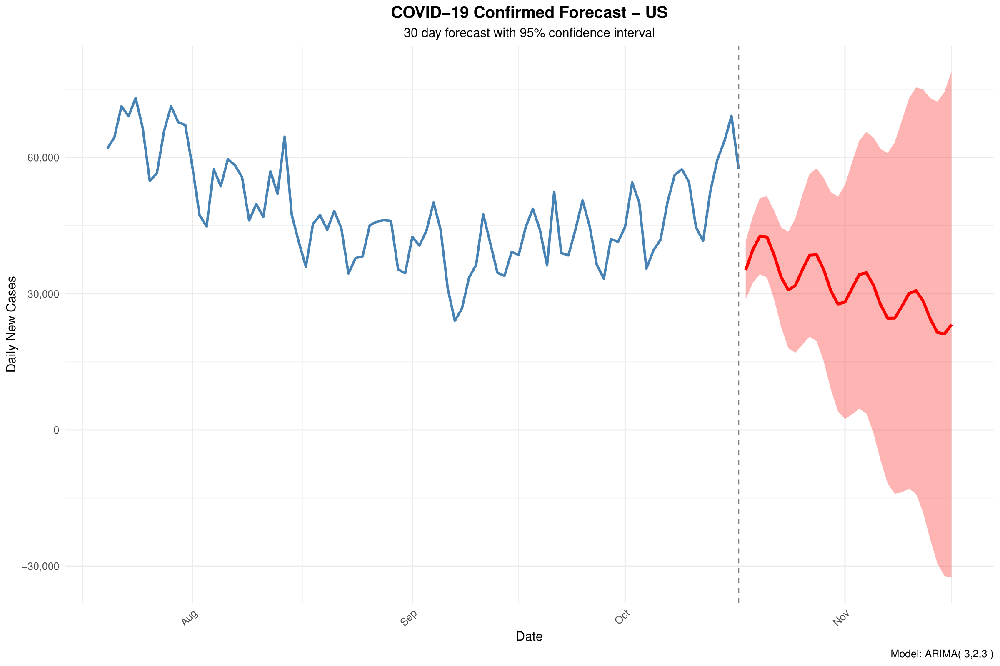
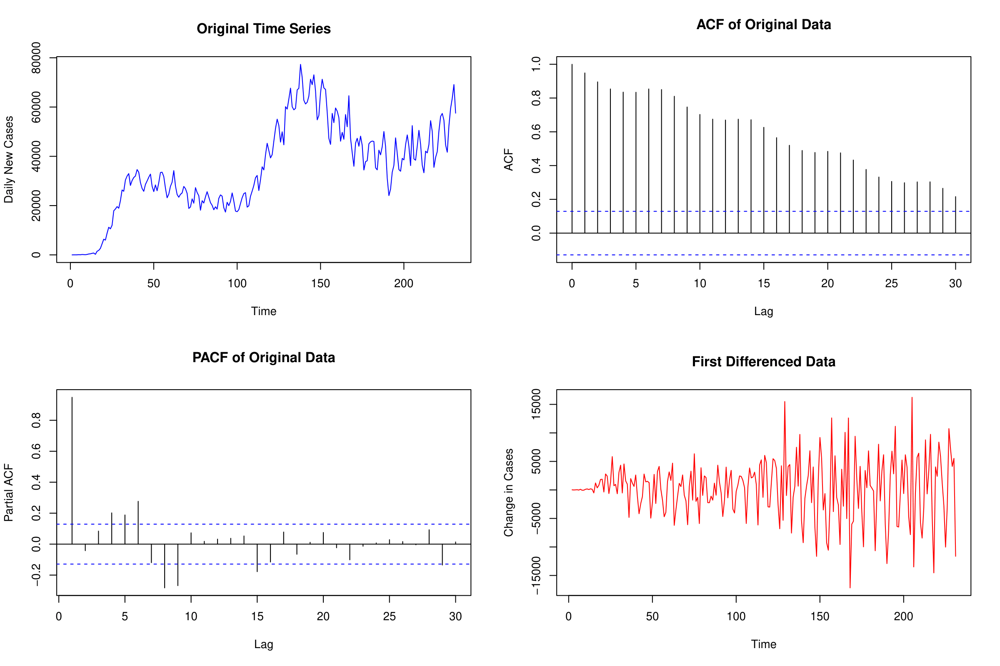

<h1 align="center">COVID-19 ARIMA Forecasting (R)</h1>

<p align="center">
  A single-file R pipeline that fits ARIMA models to COVID-19 case data — automated order selection, stationarity testing, residual diagnostics, and a 30-day forecast with confidence bands. Configurable to any country and metric in the dataset.
</p>

<p align="center">
  
  
  
  
</p>

<p align="center">
  <a href="#quickstart">Quickstart</a> ·
  <a href="#what-it-produces">What it produces</a> ·
  <a href="#configuration">Configuration</a> ·
  <a href="#honest-limitations">Limitations</a>
</p>

<p align="center">
  
</p>
<p align="center"><em>30-day forecast of daily new US cases (ARIMA(3,2,3)) with 95% prediction band, over recent history.</em></p>

## Overview

This is a self-contained R script for classical time-series forecasting of COVID-19 case counts. Point it at a country and a metric (confirmed, deaths, or recovered) and it runs the full Box-Jenkins workflow end to end: load and aggregate the series, difference to stationarity, search for an ARIMA order, check the residuals, and forecast forward with prediction intervals. It also writes the plots and a forecast table to disk.

It's built as a teaching / baseline pipeline — one file, heavily commented, with a `CONFIG` block at the top and a package manager that falls back to base-R functions if `forecast`/`tseries` aren't available. The committed results are for **US confirmed cases, 1 March – 17 October 2020** (231 daily observations, ~8.1M cumulative cases, peak ~77k/day), but nothing in the code is US-specific.

## Quickstart

```bash
git clone https://github.com/thelostbong/ARIMA-time-series-forecasting.git
cd ARIMA-time-series-forecasting
```

Install the R packages (once):

```r
install.packages(c("forecast", "tseries", "ggplot2", "dplyr", "gridExtra"),
                 dependencies = TRUE)
```

Then run it any of these ways:

```bash
Rscript COVID19_UNIFIED_ANALYSIS.R      # command line
```
```r
source("COVID19_UNIFIED_ANALYSIS.R")    # R / RStudio console
```

On Windows you can also double-click `RUN_COVID_ANALYSIS.bat`.

> [!NOTE]
> The dataset `time-series-19-covid-combined.csv` (Johns Hopkins CSSE, via Datasets/`covid19`) ships with the repo, so the script runs out of the box with no download step.

## What it produces

The script fits ARIMA in two passes — `auto.arima()` first, then an exhaustive grid search over p ∈ 0..3, d ∈ 0..2, q ∈ 0..3, keeping the lowest-AIC model. On the committed US-confirmed series that lands on **ARIMA(3,2,3)** (independently reproduced). It then runs a Ljung-Box test on the residuals, evaluates on a 20% holdout (MAE/RMSE), and forecasts 30 days ahead.

Outputs written to disk on each run:
- A multi-page PDF of every plot (`COVID19_Analysis_Plots_<country>_<date>.pdf`)
- The forecast table as CSV (`COVID_Forecast_<country>_<date>.csv`)
- The full results object as `.RData` (config, model, diagnostics, forecast)

The five plots in `Results/` are example outputs from the US run:

| Plot | Shows |
|---|---|
| `cumulative_cases.png` | Cumulative and daily-new case trends |
| `acf_pacf_analysis.png` | ACF/PACF before and after differencing |
| `distribution_qq_plots.png` | Histogram + Q-Q plot of the differenced series |
| `residual_diagnostics.png` | Residual series, ACF, PACF, Q-Q of the fitted model |
| `forecast.png` | 30-day forecast with 95% band (the hero above) |

<p align="center">
  
</p>

## Configuration

Everything is driven by the `CONFIG` list at the top of the script — no other edits needed:

```r
CONFIG <- list(
  target_country   = "US",          # any country in the CSV: "China", "Italy", ...
  target_metric    = "Confirmed",   # "Confirmed" | "Deaths" | "Recovered"
  start_date       = as.Date("2020-03-01"),
  forecast_horizon = 30,            # days to forecast
  train_ratio      = 0.8,           # 80/20 train/test split
  max_p = 3, max_d = 2, max_q = 3,  # ARIMA order search bounds
  save_results = TRUE, create_plots = TRUE, verbose = TRUE
)
```

## Honest limitations

> [!IMPORTANT]
> This is a baseline model, not a validated forecaster — and it's worth being straight about why.

A non-seasonal ARIMA on **daily** case counts ignores the strong weekly reporting cycle (cases dip on weekends and rebound midweek). On the US confirmed series, that leaves visible autocorrelation in the residuals: the Ljung-Box test fails (residuals are not white noise), so the model does not fully capture the structure. The point forecast is reasonable as a short-horizon baseline, but the prediction intervals should be read as optimistic.

That limitation is the whole motivation for the roadmap below — a seasonal model (SARIMA) or a changepoint model (Prophet) is the right next step, not a nicer-looking ARIMA.

> [!NOTE]
> The console prints the exact AIC, Ljung-Box p-value, and holdout MAE/RMSE for whatever configuration you run. Those figures aren't committed to the repo; capture them from your own run rather than trusting a hardcoded number.

## Repository structure

```
.
├── COVID19_UNIFIED_ANALYSIS.R          # the entire pipeline (one file)
├── RUN_COVID_ANALYSIS.bat              # Windows double-click runner
├── time-series-19-covid-combined.csv   # JHU CSSE dataset (ships with repo)
├── Results/                            # example plots from the US run
│   ├── cumulative_cases.png
│   ├── acf_pacf_analysis.png
│   ├── distribution_qq_plots.png
│   ├── residual_diagnostics.png
│   └── forecast.png
└── LICENSE
```

## Roadmap

- **SARIMA** to model the weekend reporting cycle — the clearest fix for the residual autocorrelation above.
- **Prophet** for changepoints and holiday effects.
- **ARIMAX** with exogenous regressors (mobility indices, policy dates).
- Walk-forward (rolling-origin) validation instead of a single static holdout forecast, which drifts badly at long horizons for a d=2 model.
- Commit the console metrics (AIC, Ljung-Box, MAE/RMSE) for the reference US run so results are reproducible without re-running.

## References

- Hyndman, R.J. & Athanasopoulos, G. (2021). *Forecasting: Principles and Practice*, 3rd ed. OTexts.
- Box, Jenkins, Reinsel & Ljung (2015). *Time Series Analysis: Forecasting and Control*. Wiley.
- COVID-19 data: [JHU CSSE](https://github.com/CSSEGISandData/COVID-19).

## License · Author

MIT License — see [LICENSE](LICENSE).

**Nayeemuddin Mohammed** — M.Sc. Applied AI for Digital Production Management, THD
[GitHub](https://github.com/thelostbong) · [LinkedIn](https://linkedin.com/in/nayeemuddin-mohammed-03/) · nayeemuddin.mohammed@th-deg.de
